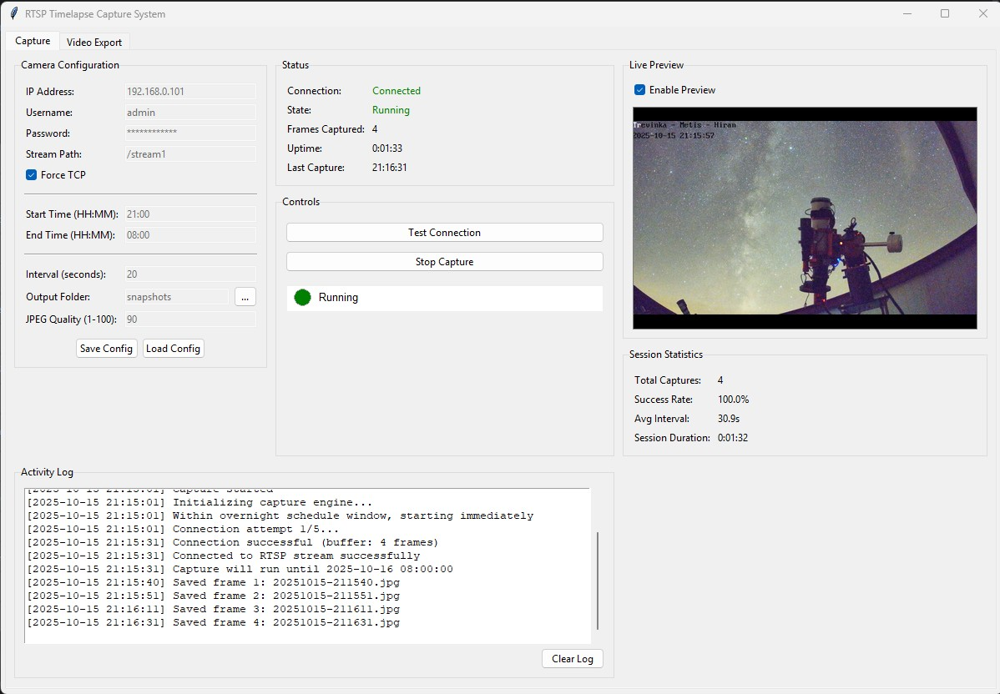
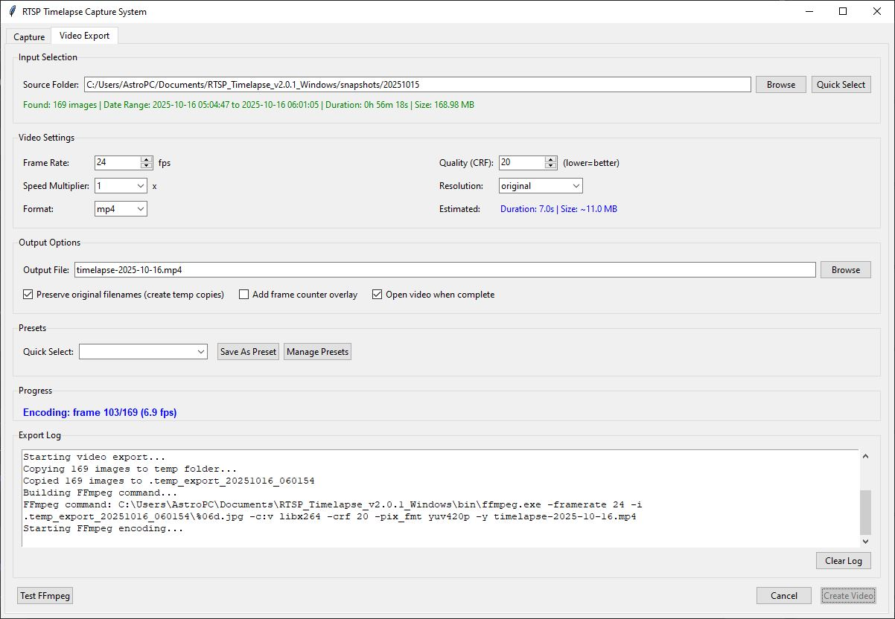
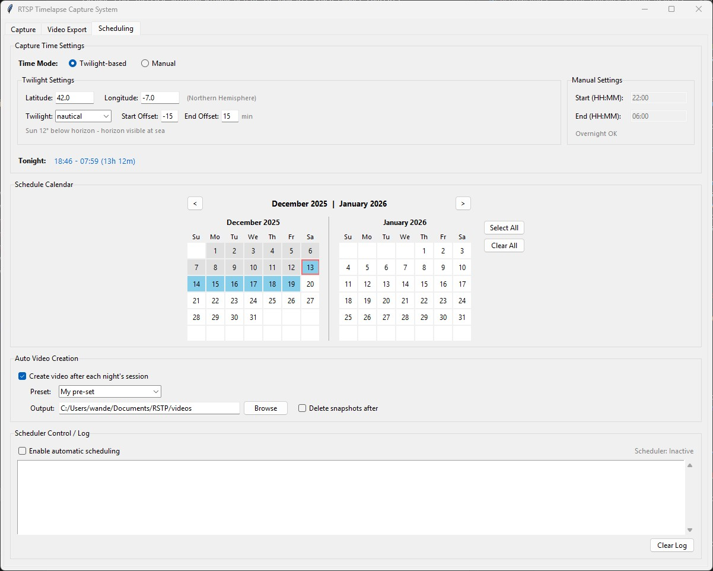

# RTSP Timelapse Capture System

> A professional Windows desktop application for capturing and creating timelapse videos from RTSP camera streams.


**Complete end-to-end timelapse workflow:** capture stills + export to video + manage it all from one GUI.

---

## Key Features

### Image Capture
- RTSP stream capture with optional TCP forcing for stability.
- **Multi-threaded bufferless capture** for accurate timestamps (±5 second precision).
- **Proactive reconnection** to prevent camera firmware timeouts (100% capture success rate).
- Smart scheduling that supports overnight windows (e.g., 20:00 → 08:00).
- Automatic interval capture from 1 to 3600 seconds.
- Automatic date-based folder structure for snapshots.
- Adjustable JPEG output quality (1–100%).
- Live preview with auto-scaling and JPEG compression control.
- Session statistics with uptime, success rate, and error tracking.

### Video Export
- One-click export from image folders to MP4.
- Six built-in presets plus unlimited custom presets.
- Full control over frame rate, CRF quality, resolution, and playback speed.
- Non-destructive—source images are never modified.
- Real-time progress, ETA, and output size estimates.
- Optional frame counter overlay.

### Astronomical Scheduling (NEW in v3.0)
- **Long-term capture planning** with calendar-based date selection.
- **Twilight calculations** for automatic darkness detection (civil, nautical, astronomical).
- **Manual time mode** as alternative to twilight-based scheduling.
- **Two-month calendar view** showing captured dates, scheduled dates, and today.
- **Auto video creation** after each night's capture session completes.
- **Auto delete snapshots** option to free up disk space after video creation.
- **Color-coded scheduler log** for monitoring automated capture activity.
- Start/end time offsets to fine-tune the darkness window.

### User Experience
- Three-tab interface: **Capture**, **Video Export**, and **Scheduling**.
- **Comprehensive tooltip system** with 37 hover tooltips explaining every control.
- Keyboard shortcuts for common actions.
- Auto-save configuration when switching tabs and on app close.
- Thread-safe capture engine keeps the UI responsive.
- Color-coded activity log with timestamps.
- Cross-platform Python source (Windows-focused release builds).

---

## Screenshots

### Capture Tab

*Live capture interface showing camera configuration, real-time preview, session statistics, and activity logging.*

### Video Export Tab

*Video export interface with input selection, customizable settings, presets management, and real-time encoding progress.*

### Scheduling Tab (NEW in v3.0)

*Astronomical scheduling interface with twilight/manual time modes, two-month calendar, auto video creation, and scheduler log.*

---

## Quick Start

1. **Clone the repository**
   ```bash
   git clone https://github.com/yourusername/rtsp-timelapse.git
   cd rtsp-timelapse
   ```

2. **Install dependencies**
   ```bash
   # Create virtual environment
   python -m venv .venv

   # Activate (Windows)
   .venv\Scripts\activate

   # Activate (Linux/Mac)
   source .venv/bin/activate

   # Install packages
   pip install -r requirements.txt
   ```

3. **Install FFmpeg** (required for video export)
   - Download from [ffmpeg.org](https://ffmpeg.org/download.html).
   - Add `ffmpeg.exe` to your PATH **or** place it in a `bin/` folder beside the app.
   - Verify with `ffmpeg -version`.

4. **Launch the application**
   ```bash
   python run_gui.py
   ```

---

## Using the Capture Tab

### Learning the Interface

**Hover your mouse** over any button, input field, or checkbox for helpful tooltips that explain:
- What the control does
- Expected values and formats
- Recommended settings
- Keyboard shortcuts
- Common examples

**Example tooltips:**
- *IP Address:* "IP address of your RTSP camera on the local network. Example: 192.168.0.101"
- *Proactive Reconnect:* "Automatically reconnect every N seconds to prevent timeouts. Recommended: 420s for Annke cameras"
- *Frame Rate:* "Video playback speed in fps. 24 = cinematic, 30 = smooth, 60 = ultra-smooth"

1. **Configure Camera**
   ```
   Camera Settings:
     IP Address:  192.168.0.101
     Username:    admin
     Password:    ********
     Stream Path: /stream1
     Force TCP:   Enabled (recommended for most IP cameras)
   ```

2. **Set Schedule**
   ```
   Schedule:
     Start Time:  20:00  (8:00 PM)
     End Time:    08:00  (8:00 AM)
     Interval:    30     (seconds)
   ```

3. **Start Capture**
   - Click **Test Connection** to verify credentials and stream.
   - Click **Start Capture** to begin the timelapse session.
   - Watch the live preview, session statistics, and activity log.

4. **Output Structure**
   ```
   snapshots/
     20251015/
       20251015-224000.jpg
       20251015-224020.jpg
       ...
     20251016/
       20251016-070000.jpg
       ...
   ```

---

## Creating Videos from Snapshots

### Quick Export with Presets

1. Switch to the **Video Export** tab.
2. Click **Quick Select** and choose the desired date folder.
3. Pick a preset:
   - **Standard 24fps** – Balanced quality.
   - **High Quality 30fps** – Lower compression, smoother output.
   - **Fast Motion 60fps** – Every 4th frame for ultra-smooth motion.
   - **Web Optimized** – Ready for YouTube/social uploads.
   - **Storage Saver** – Small files for archival use.
   - **Ultra Speed 16x** – Extreme speed-ups for rapid reviews.
4. Click **Create Video**. The video opens automatically if you enable that option.

### Custom Export

- **Frame Rate**: 1–120 fps (24 for cinematic, 30 for smooth, 60 for ultra-smooth).
- **Quality (CRF)**: 18 = visually lossless, 20 = default, 23+ = smaller files.
- **Speed Multiplier**: Skip frames to speed up (2×, 4×, 8×, 16×, 32×).
- **Resolution**: Keep original size or scale to 4K / 1080p / 720p / 480p / 360p.
- **Overlay**: Optional frame counter overlay for QA workflows.

Example outputs for 1,234 images captured over 6 hours:
```
Standard Export:
  24 fps, 1x speed → 51 s video, ~12 MB

Fast Motion:
  60 fps, 4x speed → 5 s video, ~3 MB

Ultra Speed:
  30 fps, 16x speed → 2.5 s video, ~1 MB
```

---

## Using the Scheduling Tab (NEW in v3.0)

The Scheduling tab enables **automated long-term capture planning** based on astronomical twilight times or manual schedules.

### Important: Configure Other Tabs First

Before using the Scheduling tab, **configure the Capture and Video Export tabs**:

1. **Capture Tab** - Set up these settings:
   - RTSP URL for your camera
   - Capture interval (recommended: 30 seconds)
   - Output folder for snapshots
   - JPEG quality
   - Settings are auto-saved when you switch tabs

2. **Video Export Tab** - Set up these settings:
   - Select a video preset (or create a custom one)
   - Set your preferred output location
   - These settings are used by auto video creation

3. **Scheduling Tab** - Now configure automated scheduling:
   - The scheduler uses Capture tab settings for image capture
   - Auto video creation uses Video Export tab settings

### Time Mode Selection

Choose between two scheduling modes:

**Twilight-based Mode** (Default):
- Set your location (latitude/longitude)
- Select twilight type: Civil (-6°), Nautical (-12°), or Astronomical (-18°)
- The app calculates darkness windows automatically
- Optionally add start/end offsets to fine-tune the window

**Manual Mode**:
- Set fixed start and end times (HH:MM format)
- Supports overnight spans (e.g., 22:00 - 06:00)
- No location settings required

### Setting Up Automated Captures

1. **Configure Time Settings**
   ```
   Twilight-based:
     Latitude:  42.0 (Northern Hemisphere)
     Longitude: -7.0
     Twilight:  Astronomical (true darkness)
     Offsets:   Start +0 min, End +0 min

   OR Manual:
     Start Time: 22:00
     End Time:   06:00
   ```

2. **Select Dates on Calendar**
   - Click dates to toggle selection (blue = scheduled)
   - Green dates = past dates with captured images
   - Gray dates = past dates without captures
   - Red border = today
   - Use **Select All** / **Clear All** buttons for bulk operations
   - Navigate months with **<** and **>** buttons

3. **Configure Auto Video (Optional)**
   ```
   [✓] Create video after each night's session
   [ ] Delete snapshots after (use with caution!)
   ```
   *Note: Uses preset and output folder from Video Export tab*

4. **Enable Scheduler**
   - Check "Enable automatic scheduling"
   - The scheduler monitors twilight/manual times
   - Capture starts automatically when darkness begins
   - Capture stops automatically when darkness ends
   - Videos are created automatically if enabled

### Scheduler Status

- **Scheduler: Inactive** - Scheduler is disabled
- **Scheduler: Active (waiting)** - Waiting for darkness window
- **Scheduler: Capturing** - Currently capturing frames

### Scheduler Log

Monitor scheduler activity in the color-coded log:
- **INFO** (black): Normal operations
- **WARNING** (orange): Non-critical issues
- **ERROR** (red): Problems requiring attention

---

## Configuration Reference

### Camera Settings

| Setting     | Description                | Example                    |
|-------------|----------------------------|----------------------------|
| IP Address  | Camera IP on your network  | `192.168.0.101`            |
| Username    | RTSP authentication user   | `admin`                    |
| Password    | RTSP authentication pass   | `YourPassword123`          |
| Stream Path | Camera-specific RTSP path  | `/stream1`                 |
| Force TCP   | Use TCP for stability      | `True` (recommended)       |

**Common RTSP Paths**
- **Hikvision**: `/Streaming/Channels/101`
- **Dahua**: `/cam/realmonitor?channel=1&subtype=0`
- **Ubiquiti/UniFi**: `/s0`
- **Generic**: `/stream1`, `/live`, `/h264`

### Schedule Settings

| Setting     | Description                       | Example |
|-------------|-----------------------------------|---------|
| Start Time  | Capture start (24-hour HH:MM)     | `22:40` |
| End Time    | Capture end (24-hour HH:MM)       | `07:00` |
| Interval    | Seconds between captures          | `20`    |
| Rollover    | Hour after midnight to switch day | `12`    |

Overnight windows (start later than end) are handled automatically.

### Capture Settings

| Setting                  | Description                      | Default  |
|--------------------------|----------------------------------|----------|
| Output Folder            | Base folder for snapshots        | `snapshots` |
| Interval (seconds)       | Time between captures            | `30` |
| JPEG Quality             | Saved image quality (higher = better quality but larger files) | `95` |
| Buffer Frames            | Frames to buffer in OpenCV       | `1` |
| Max Retries              | Connection retry attempts        | `3` |
| Proactive Reconnect (s)  | Reconnect interval to prevent camera timeout | `300` (5 min) |

**v2.3.0 Defaults**: Optimized for maximum timestamp accuracy and reliability. These ready to use values achieve ±5 second precision with 100% capture success rate.

---

## Camera Configuration Tips

- **Verify credentials**: Use VLC or `ffplay` to confirm IP, username, password, and stream path before configuring the app.
- **Prefer TCP**: Many consumer IP cameras are unreliable over UDP; keep **Force TCP** enabled unless the camera vendor recommends otherwise.
- **Mind network latency**: For remote cameras, increase `buffer_frames` (e.g., to 6-8) if you frequently see reconnect messages.
- **Deal with overnight lighting**: Configure the camera's own exposure or IR settings; the app captures whatever the RTSP feed delivers.
- **Multiple cameras**: Copy `config/app_config_example.json` per device and load them through the GUI to swap configurations quickly.
- **Security**: Store configs in a protected location if the RTSP password is sensitive; the app saves the password in plain text JSON.
- **Prevent camera timeouts**: Enable **Proactive Reconnect** to maintain 100% capture success rate. Most IP cameras have firmware timeouts (typically 5-10 minutes). Set the reconnect interval to ~40 seconds before your camera's timeout for uninterrupted captures.

### Optimal Settings for Annke I81EM Cameras

Based on extensive testing with Annke I81EM IP cameras, two configurations are recommended depending on your needs:

**Camera Settings (Web Interface) - Same for Both Configurations:**
- Frame Rate: `10 FPS` (provides fresh frames without overwhelming buffer)
- I Frame Interval: `4` (keyframe every 0.4 seconds for accurate timestamps)
- Max Bitrate: `3072 Kbps` or lower (stable streaming over network)

#### Configuration: Maximum Timestamp Accuracy (Recommended)

**Best for:** Most timelapse applications where timestamp precision matters

**Application Settings:**
- Capture Interval: `30 seconds`
- Buffer Frames: `1` (minimal buffer for freshest frames)
- Proactive Reconnect: `300 seconds` (5 minutes - before 460s camera timeout)
- Force TCP: `Enabled` (required for stability)

**Performance Results:**
- 100% capture success rate
- Timestamp accuracy: **±5 seconds** (stable throughout session) - 96% improvement over baseline
- Extremely stable and predictable behavior
- No drift accumulation over time
- Lower system overhead
- 120 frames per hour

#### Performance Comparison: Baseline vs v2.3.0

| Metric | Baseline (Pre-v2.3.0) | v2.3.0 Multi-threaded | Improvement |
|--------|----------------------|----------------------|-------------|
| **Timestamp Accuracy (initial)** | +35 seconds | +19 seconds | **46% better** |
| **Timestamp Accuracy (steady)** | -4m 50s (-290s) | ±5 seconds | **96% better** |
| **Drift stability** | Accumulates over time | Stable (no accumulation) | **Major improvement** |
| **Success rate** | 100% | 100% | Maintained |
| **Frames per hour** | 120 frames | 120 frames | Same |
| **System overhead** | Moderate | Low | **Reduced** |

**Recommendation:** Version 2.3.0's multi-threaded bufferless capture achieves exceptional ±5 second timestamp accuracy with zero drift accumulation, making it ready for all timelapse applications requiring timestamp precision.

**Note:** Other Annke models may have different timeout intervals. Test your camera's behavior and adjust the proactive reconnect interval to ~40 seconds before the observed timeout.

---

## Keyboard Shortcuts

### Capture Tab

| Shortcut | Action                |
|----------|-----------------------|
| `Ctrl+T` | Test camera connection|
| `Space`  | Start capture         |
| `Esc`    | Stop capture          |

*Note: Configuration is auto-saved when switching tabs and before closing the app.*

### Video Export Tab

| Shortcut | Action              |
|----------|---------------------|
| `Ctrl+E` | Focus export tab    |
| `Ctrl+B` | Browse for folder   |
| `Enter`  | Begin export        |
| `Esc`    | Cancel export       |

---

## Testing & Automation

- `tests/test_backend.py` exercises configuration management and capture logic with interactive prompts.
- `tests/test_backend_auto.py` runs the same checks without user input (connection tests will fail harmlessly if no camera is reachable).
- `tests/test_video_export.py` validates the export pipeline; provide a populated `snapshots/YYYYMMDD` folder before running it.

---

## Build & Release

- `build_release.bat` builds a PyInstaller executable and packages a release folder (optionally bundling FFmpeg).
- `bundle_ffmpeg.bat` copies FFmpeg/FFprobe into the release bundle.
- `RTSP_Timelapse.spec` defines the PyInstaller build (GUI-only executable with bundled resources).

---

## Troubleshooting

### Camera Connection Issues

**Cannot connect to camera:**
- Verify camera IP with `ping 192.168.0.101`.
- Test stream URL in VLC: `rtsp://user:pass@ip/stream1`.
- Check port 554 (RTSP) is not blocked by firewall.
- Enable **Force TCP** option if using UDP causes dropouts.

**Connection drops frequently:**
- Enable **Force TCP** for more stable connections.
- Enable **Proactive Reconnect** to reconnect before camera timeout (recommended: 420 seconds for Annke cameras).
- Check network stability between PC and camera.
- Increase capture interval to reduce request frequency.
- Check camera settings for session timeout/keepalive options.
- If drops occur at exact intervals (e.g., every 460 seconds), this is a camera firmware timeout - use proactive reconnect set to ~40 seconds before the timeout.

### Video Export Issues

**FFmpeg not found:**
- Download FFmpeg from [ffmpeg.org](https://ffmpeg.org/download.html).
- Add to system PATH **or** place in `bin/` folder next to executable.
- Ensure all FFmpeg DLL files are present (~150 MB total).
- Click **Test FFmpeg** button to verify installation.

**Export is slow:**
- Lower resolution (720p or 480p instead of original).
- Increase CRF quality value (23-28 for smaller files).
- Use speed multiplier (2×, 4×) to skip frames.
- Close other applications to free system resources.

**Video won't play:**
- Ensure using MP4 format (most compatible).
- Try opening in VLC media player.
- Check FFmpeg log for encoding errors.

### Performance Issues

**GUI is slow or laggy:**
- Disable live preview (uncheck "Enable Preview").
- Lower JPEG quality (70-80 instead of 90).
- Increase capture interval (30s+ instead of 20s).
- Close background applications.

**Disk filling up:**
- Monitor available disk space regularly.
- Lower JPEG quality to reduce file sizes.
- Delete old snapshots after exporting to video.
- Use "Storage Saver" preset for smaller video files.

**Disk Space Calculator:**
```
At quality 90, each 1280×720 frame ≈ 400 KB

Formula: (3600 / interval) × hours × 0.4 MB

Example: 20s interval for 8 hours
  = (3600/20) × 8 × 0.4
  = 576 MB for images
  + ~50 MB for final video
  = ~625 MB total
```

## System Requirements

**For built executable (.exe):**
- Windows 10/11 (64-bit)
- 4 GB RAM
- 2 GB free disk space (plus additional storage for captures and videos)
- Network connection to RTSP camera
- FFmpeg (for video export)

**For running from source:**
- Windows 10/11, Linux, or macOS
- Python 3.9 or higher
- Dependencies from requirements.txt
- FFmpeg (for video export)

## Project Structure

```
RTSP/
├── run_gui.py                    # Application launcher
├── requirements.txt              # Python dependencies
├── README.md                     # This file
├── LICENSE                       # MIT License
├── .gitignore                    # Git ignore rules
│
├── src/                          # Source code
│   ├── gui_app.py               # Main GUI (tabbed interface)
│   ├── capture_engine.py        # RTSP capture logic
│   ├── config_manager.py        # Configuration management
│   ├── video_export_panel.py    # Video export GUI
│   ├── video_export_controller.py # Video export logic
│   ├── ffmpeg_wrapper.py        # FFmpeg integration
│   ├── preset_manager.py        # Preset management
│   ├── tooltip.py               # Tooltip helper class
│   ├── video_export_tooltips.py # Video export tooltip messages
│   ├── capture_tooltips.py      # Capture tab tooltip messages
│   ├── scheduling_panel.py      # Astronomical scheduling GUI (NEW v3.0)
│   ├── scheduling_tooltips.py   # Scheduling tab tooltip messages (NEW v3.0)
│   ├── calendar_widget.py       # Two-month calendar widget (NEW v3.0)
│   ├── twilight_calculator.py   # Twilight time calculations (NEW v3.0)
│   └── astro_scheduler.py       # Automated scheduling engine (NEW v3.0)
│
├── tests/                        # Test files
│   ├── test_backend.py          # Interactive backend tests
│   ├── test_backend_auto.py     # Automated tests
│   └── test_video_export.py     # Video export tests
│
├── config/                       # Configuration files
│   └── app_config_example.json  # Template
│
├── user_data/                    # User-generated data (gitignored)
│   ├── capture_history.json     # Session history for calendar
│   └── video_export_presets.json # Custom video presets
│
└── snapshots/                    # Captured images (gitignored)
    └── YYYYMMDD/                # Date-organized folders
        └── YYYYMMDD-HHMMSS.jpg  # Timestamped images
```

## Q&A

**Q: Can I use multiple cameras?**
A: Currently supports one camera per instance. Run multiple instances for multiple cameras with separate config folders.

**Q: Does it work on Linux/macOS?**
A: Yes! The Python source is cross-platform. Install dependencies and FFmpeg for your OS. Windows releases include pre-built executables.

**Q: Can I run it headless (no GUI)?**
A: Not currently. The legacy CLI version (`src/main.py`) exists but isn't maintained. The GUI is recommended.

**Q: What RTSP URL format do I use?**
A: Depends on your camera brand. See [Camera Settings](#camera-settings) for common paths. Test with VLC first: `rtsp://user:pass@ip/path`.

**Q: My camera requires a specific port. How do I set it?**
A: Include port in IP address field: `192.168.0.101:8554`

**Q: What's the best preset for YouTube?**
A: Use **"Web Optimized"** (30fps, 720p) or **"High Quality 30fps"** (original resolution).

**Q: How do I make a very fast timelapse?**
A: Use **"Ultra Speed 16×"** preset or set Speed Multiplier to 8×/16×/32×.

**Q: Can I add music to the video?**
A: Not built-in. Use video editing software (like DaVinci Resolve, Premiere, or OpenShot) to add audio after export.

**Q: Why are my original files safe?**
A: The export creates temporary numbered copies in a `.temp_export_*/` folder. Your originals are never renamed or modified. The temp folder is automatically deleted after export.

**Q: What is Proactive Reconnect and should I use it?**
A: Proactive Reconnect automatically disconnects and reconnects to the camera at a scheduled interval **before** the camera's firmware timeout occurs. This prevents failed captures during timeout periods. Enable it if you notice connection drops at regular intervals (e.g., every 5-10 minutes). Set the value to ~40 seconds before your camera's timeout. For Annke I81EM cameras, use 420 seconds (7 minutes).

**Q: How do I know what reconnect interval to use?**
A: Monitor your logs for "Connection lost" messages. If they occur at regular intervals (e.g., exactly every 460 seconds), that's your camera's timeout. Set Proactive Reconnect to that value minus 40 seconds. Example: 460s timeout → use 420s reconnect interval.

**Q: Why are my snapshot timestamps off by 30 seconds?**
A: This is normal! The timestamp in the filename is when the capture was initiated. The timestamp embedded by the camera in the image is when the frame was encoded. With optimal settings (10 FPS, I-frame 4), this difference should be 5-33 seconds with Configuration A (30s/300s) or 33s-4min with Configuration B (20s/420s). This is acceptable for timelapse purposes.

**Q: What capture interval should I use?**
A: **30-second intervals are optimal** for balancing timestamp accuracy, frame rate, and system performance. Based on extensive testing documented in `docs/TIMESTAMP_ACCURACY_ANALYSIS.md`:

**Experimental Results (60s vs 30s intervals):**
- **Post-reconnect accuracy**: 30s achieves **+23s drift** vs 60s achieves **-7s drift**
- **Sign flip significance**: Positive drift (+23s) means fresher frames vs negative drift (-7s) means stale frames
- **Frame density**: 30s provides **120 frames/hour** vs 60s provides only 60 frames/hour
- **Staleness accumulation**: 30s accumulates drift at **half the rate** of 60s intervals
- **Reliability**: Both achieve **100% capture success rate**

**Why 30s is better:**
The buffer staleness accumulates proportionally to the capture interval. At 30s intervals, frames are captured twice as often, so the buffer never gets as stale as with 60s intervals. The positive post-reconnect drift (+23s) indicates the captured frame is only 23 seconds old, versus 60s intervals where negative drift (-7s) indicates frames from the bottom of a stale buffer.

**When to adjust:**
- **Faster scenes** (clouds, traffic): Use 20s for 180 frames/hour (more storage needed)
- **Slower scenes** (construction, plants): 30s is perfect for 120 frames/hour
- **Very slow scenes** (astronomy, shadows): 60s for 60 frames/hour is acceptable

v2.3.0 ships with **30s as the default** - optimized for the best balance of accuracy and performance.

**Q: What does timestamp accuracy mean for my timelapse?**
A: Timestamp accuracy is the difference between the **filename timestamp** (when your PC saved the file) and the **camera-embedded timestamp** (when the camera actually encoded that frame).

**Why it matters:**
- **Visual continuity**: Frames should represent actual temporal progression, not stale buffered frames
- **Scientific applications**: Astronomical/weather timelapses need accurate time correlation
- **Quality indicator**: Large drift (minutes) indicates buffering issues in your setup

**v2.3.0 Performance:**
With the new multi-threaded bufferless capture, you get:
- **±5 seconds steady-state accuracy** (vs baseline -4m 50s, that's 96% improvement)
- **Zero drift accumulation** across the entire session
- **Stable accuracy** even after multiple reconnection cycles

**For timelapse playback:**
Even with older versions showing 1-2 minute drift, this is **visually imperceptible** when played at 24-30 fps. Your timelapse will look smooth and continuous.

**For scientific/critical applications:**
v2.3.0's ±5 second precision is suitable for:
- Weather pattern analysis
- Astronomical observations
- Construction documentation with precise time-stamping
- Any application requiring sub-minute accuracy

The days of worrying about timestamp drift are over with v2.3.0!

**Q: How do I learn what each setting does?**
A: Simply hover your mouse over any control (button, input field, checkbox, etc.) and wait ~500ms. A helpful tooltip will appear explaining what it does, expected values, and recommendations. The app has 37 tooltips covering every important control.

**Q: Can I disable tooltips?**
A: Tooltips are built into the interface and cannot be disabled. However, they only appear when you hover for 500ms, so they won't interfere with normal usage. They disappear instantly when you move your mouse away.

---

## Version History

### v3.0.0 (2025-12-19) - Latest
**Major Release: Astronomical Scheduling**

New third tab for automated long-term capture planning based on twilight times or manual schedules.

**New Features:**
- **Scheduling Tab**: Complete astronomical scheduling interface
- **Twilight Calculations**: Automatic darkness window detection (civil/nautical/astronomical)
- **Manual Time Mode**: Fixed start/end times as alternative to twilight-based scheduling
- **Two-Month Calendar**: Visual date selection with capture history indicators
- **Auto Video Creation**: Automatically create timelapse videos (uses Video Export tab settings)
- **Auto Delete Snapshots**: Option to free disk space after video creation
- **Scheduler Log**: Color-coded activity monitoring (INFO/WARNING/ERROR)
- **Location Settings**: Latitude/longitude with hemisphere indicator
- **Capture History**: Calendar shows captured dates even after snapshots are deleted
- **Preset Memory**: Last selected video preset is remembered across sessions

**Improvements:**
- **Auto-save configuration** when switching tabs and before closing app (no manual save/load needed)
- Video Export Quick Select now uses Capture tab's output folder
- Relative paths resolve correctly when running as bundled executable
- Scheduler correctly uses calculated twilight times
- Default "Open video when complete" to unchecked
- Default schedule times changed to 20:00-08:00
- Config consolidated to `config/app_config.json`
- User data (capture history, presets) moved to `user_data/` folder
- Removed unused config fields for cleaner configuration

**UI Improvements:**
- Three-tab interface (Capture | Video Export | Scheduling)
- Two-column layout for Twilight vs Manual time settings
- Radio buttons to switch between time modes
- Calendar legend on right side under buttons
- Compact layout with all settings visible

**Technical:**
- New `AstroScheduler` class for background schedule monitoring
- `TwilightCalculator` for accurate sun position calculations
- `TwoMonthCalendar` custom widget with date status indicators
- `CaptureHistoryManager` for persistent session tracking
- New config fields: `use_manual_times`, `manual_start_time`, `manual_end_time`
- Scheduler integrates with existing capture engine

---

### v2.3.0 (2025-10-20)
**Major Release: Multi-Threaded Bufferless Capture**
- **Revolutionary timestamp accuracy**: ±5 seconds throughout entire capture session (96% improvement over baseline)
- **Multi-threaded capture engine**: Background thread continuously reads frames, discards stale ones
- **Zero drift accumulation**: Maintains stable ±5s accuracy across multiple reconnection cycles
- **FFmpeg low-latency flags**: Optimized RTSP streaming with minimal buffering
- **Production-ready defaults**: Optimal Configuration A values pre-configured out of the box
- **Validated extensively**: 26-minute and 4-hour test sessions with 100% success rate

**Technical Improvements:**
- Implemented `RTSPBufferlessCapture` class with queue-based architecture (maxsize=1)
- Queue automatically discards old frames, keeps only latest
- Compatible API with cv2.VideoCapture for seamless integration
- Logs show "Multi-threaded bufferless mode" for verification
- Cleaner logging with technical terminology

**Default Configuration Updates:**
- Interval: 20s → 30s (optimal for accuracy)
- JPEG Quality: 90 → 95 (archival quality)
- Buffer Frames: 2 → 1 (minimal for multi-threaded)
- Max Retries: 5 → 3 (quick failure detection)
- Proactive Reconnect: 0 → 300s (enabled by default)

**Performance Results:**
- Initial capture: +19s (vs baseline +35s, 46% better)
- Steady-state: ±5s (vs baseline -4m 50s, 96% better)
- Drift behavior: Stable (vs accumulating over time)
- Success rate: 100% maintained

**GUI Improvements:**
- Button and UI automatically reset when capture window ends
- Stop button changes to "Start Capture" when session completes
- Configuration inputs re-enable automatically

**Bug Fixes:**
- Fixed Stop button remaining active after end time reached
- Fixed configuration inputs not re-enabling after capture end

### v2.0.1 (2025-10-17) - First Public Release
**Initial Release Features:**
- RTSP camera capture with live preview and overnight scheduling support
- Complete video export functionality with FFmpeg integration
- 6 built-in presets + custom preset management
- Tabbed interface (Capture | Video Export)
- Session statistics and monitoring
- Configuration management with JSON
- Thread-safe architecture with responsive GUI
- Keyboard shortcuts for common actions
- **Comprehensive Tooltip System**: 37 hover tooltips across both tabs
  - Smart positioning with 500ms delay
  - Helpful explanations with examples and recommendations
- **Output Path Memory**: Video export remembers last export location
- **Proactive Reconnection**: Automatically reconnect before camera firmware timeouts
- Optimized buffer settings for RTSP streaming

**Bug Fixes:**
- Fixed PyInstaller executable build issues
- Bundled all FFmpeg DLLs (~150 MB) for video export
- Fixed Tkinter DLL dependencies for Windows
- Increased FFmpeg subprocess timeout to prevent false failures
- Video export works properly in standalone executable

---

## Contributing

Contributions welcome! Please:

1. Fork the repository
2. Create a feature branch: `git checkout -b feature/amazing-feature`
3. Make your changes and add tests
4. Commit: `git commit -m "Add amazing feature"`
5. Push: `git push origin feature/amazing-feature`
6. Open a Pull Request

---

## Support & Contact

- **Documentation:** Check this README and `docs/` folder [TODO]
- **Bug Reports:** [Open an issue](https://github.com/HiranD/RTSP-Timelapse-Capture/issues)
- **Feature Requests:** [Open an issue](https://github.com/HiranD/RTSP-Timelapse-Capture/issues)
- **Discussions:** [GitHub Discussions](https://github.com/HiranD/RTSP-Timelapse-Capture/discussions)

**Useful Resources:**
- [FFmpeg Download](https://ffmpeg.org/download.html)
- [RTSP Protocol Info](https://en.wikipedia.org/wiki/Real_Time_Streaming_Protocol)
- [OpenCV Documentation](https://docs.opencv.org/)

---

## Acknowledgments

- **OpenCV** - RTSP streaming and image processing
- **FFmpeg** - Professional video encoding
- **Tkinter** - Python GUI framework
- **PIL/Pillow** - Image manipulation
- **PyInstaller** - Executable packaging
- **Python Community** - Amazing ecosystem and support

---

## License

Released under the MIT License. See `version_info.txt` for Windows executable metadata.
